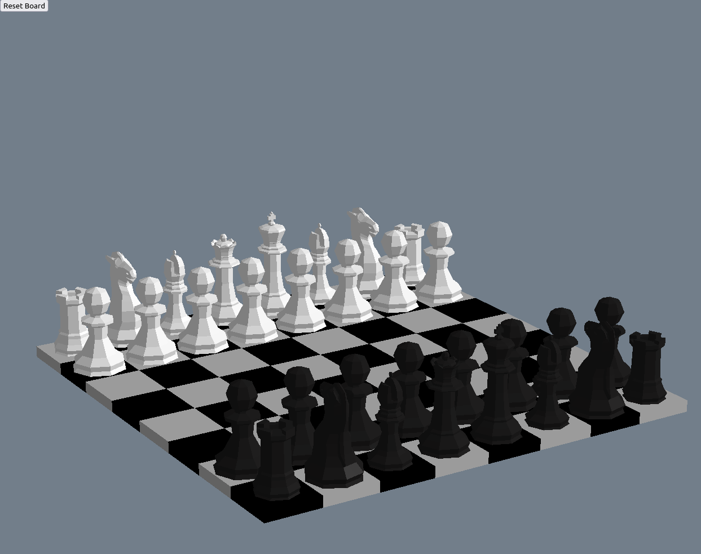

# 3D Chess Game with ThreeJS

This is a simple 3D chess game developed using JavaScript and ThreeJS. It features a 3D interactive chessboard with low-poly chess pieces, allowing you to play chess against a friend on the same device.

## Features

- 3D interactive chessboard.
- 3D chess pieces with low-poly design.
- Drag and drop chess pieces.
- Capturing opponent's pieces.
- Responsive design.
- Orbit controls for camera manipulation.
- Reset button to start a new game.

## Usage

To play the game:

1. Click and drag a chess piece to move it.
2. Release the mouse button to place the piece on a new tile.
3. Capture an opponent's piece by moving your piece to the tile it occupies.
4. If needed, click the "Reset" button to start a new game.

> Note: This chess game does not have any built-in rules enforcement or opponent AI. It is designed for two players to play against each other on the same device, manually following the rules of chess.

## Play now!
https://skyrexdev.github.io/